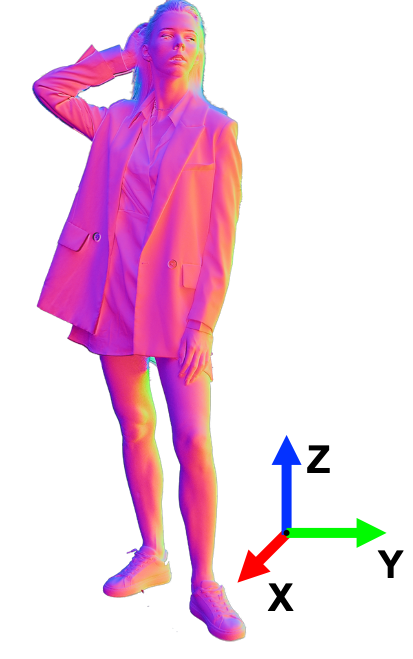

# 3D Human Dataset
The dataset of the paper "Relightable Neural Human Assets from Multi-view Gradient Illuminations".

## Relightable Neural Human Assets from Multi-view Gradient Illuminations

**[Taotao Zhou](https://github.com/Miaoing)\*, [Kai He](http://academic.hekai.site/)\*, [Di Wu]()\*, Teng Xu, Qixuan Zhang, Kuixiang Shao, [Wenzheng Chen](https://www.cs.toronto.edu/~wenzheng/), [Lan Xu](http://xu-lan.com/), [Jingyi Yu](http://www.yu-jingyi.com/).** 

**(*equal contribution) CVPR 2023**

[[Project Page]](https://miaoing.github.io/RNHA/) [[Paper Link]](https://arxiv.org/pdf/2212.07648.pdf) [[Dataset Link]](https://shanghaitecheducn-my.sharepoint.com/:f:/g/personal/hekai_shanghaitech_edu_cn/EkwUhF_qoW1CpipgeXwLZxcBMa8clsdGhdR4ub-1f5cfIw?e=5ej5FE)


### Description

We have currently uploaded 100 sample cases of data with different people and different motions. We will be uploading all the data (2K+) soon. The file structure is as follows:

- 8fuu431r1yviisw4.zip (Random filename)
  - full_on (Full on light)
    - 00000.jpg ([Camera index].jpg)
    - ...
    - 00031.jpg 
  - pos (Positive gradient light)
  - neg (Negative gradient light)
  - mask (Mask)
  - normal_alpha (Estimated normal with alpha mask channel)
  - transforms.json (The JSON file for NeRF)
- 8fuu431r2rlnjhv6.zip
- ...


*The normal maps are calculated within UltraStage’s world coordinate system, which is consistent with the camera and lighting systems. Here is the reference coordinate system of world space normal maps. For more coordinate system detail, please see our Supplementary Materials.*



### Download our dataset

The dataset is available on [OneDrive]([UltraStageDataset](https://shanghaitecheducn-my.sharepoint.com/:f:/g/personal/hekai_shanghaitech_edu_cn/EqlqCj5RaQNGgI2WkM_2N3MBjQQtXdsX-WZzhWJILlQ4nQ?e=cnHE93)) and requires permission to access it. Please carefully read, fill in the [license form](./license.pdf), and send it to Lan Xu (xulan1@shanghaitech.edu.cn) and cc MARS Lab (shanghaitechmars@foxmail.com) to request access.

By requesting access to the content, you acknowledge that you have read this agreement, understand it, and agree to be bound by its terms and conditions. This agreement constitutes a legal and binding agreement between you and the provider of the protected system or content. The Multidisciplinary Artificial Reality Studio (MARS) of ShanghaiTech University is the only owner of all intellectual property rights, including copyright, of 3D HUMAN DATASET, and MARS reserves the right to terminate your access to the dataset at any time.

Notes:

(1) Students are **NOT** eligible to be a recipient.  If you are a student, please ask your supervisor to make a request.

(2) Once the license agreement is signed, we will give access to the data.

### Citation

If you use this dataset for your research, please cite our paper:

```
 @article{zhou2022relightable,
      title={Relightable Neural Human Assets from Multi-view Gradient Illuminations},
      author={Zhou, Taotao and He, Kai and Wu, Di and Xu, Teng and Zhang, Qixuan and Shao, Kuixiang and Chen, Wenzheng and Xu, Lan and Yi, Jingyi},
      journal={arXiv preprint arXiv:2212.07648},
      year={2022}
    }
```


