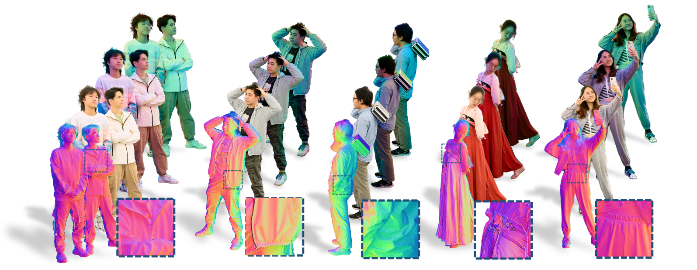

# RNHA_Dataset
The dataset of the paper "Relightable Neural Human Assets from Multi-view Gradient Illuminations".

### Relightable Neural Human Assets from Multi-view Gradient Illuminations

Taotao Zhou\*, Kai He\*, Di Wu\*, Teng Xu, Qixuan Zhang, Kuixiang Shao, Wenzheng Chen, Lan Xu, Jingyi Yu. (*equal contribution) CVPR 2023

[[Project Page]](https://miaoing.github.io/RNHA/)

